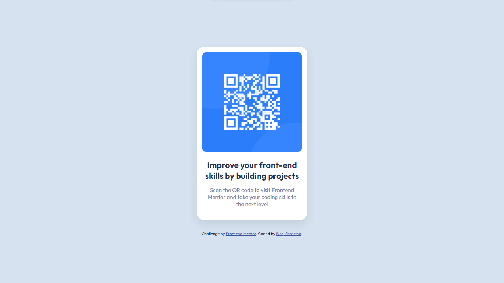

# Frontend Mentor - QR code component solution

This is a solution to the [QR code component challenge on Frontend Mentor](https://www.frontendmentor.io/challenges/qr-code-component-iux_sIO_H). Frontend Mentor challenges help you improve your coding skills by building realistic projects.

## Table of contents

- [Overview](#overview)
  - [Screenshot](#screenshot)
  - [Links](#links)
- [My process](#my-process)
  - [Built with](#built-with)
  - [What I learned](#what-i-learned)
  - [Continued development](#continued-development)
  - [Useful resources](#useful-resources)
- [Author](#author)

## Overview

### Screenshot



### Links

- Solution URL: [Add solution URL here](https://your-solution-url.com)
- Live Site URL: [Add live site URL here](https://your-live-site-url.com)

## My process

### Built with

- Semantic HTML5 markup
- CSS custom properties
- Flexbox
- Mobile-first workflow

### What I learned

```css
:root {
  --white: hsl(0, 0%, 100%);
  --light-gray: hsl(212, 45%, 89%);
  --grayish-blue: hsl(220, 15%, 55%);
  --dark-blue: hsl(218, 44%, 22%);
}
```

### Continued development

Here are some areas that I want to focus on to continue learning and refining my skills in JavaScript and React:

1. JavaScript Fundamentals:

   - Understanding the basics: variables, data types, operators, control flow, and loops.
   - Working with functions: function declaration, expressions, parameters, and return statements.
   - Manipulating arrays and objects: array methods, object properties, and iteration.
   - Asynchronous programming: Promises, async/await, and handling asynchronous data.

2. ES6+ Features:

   - Arrow functions and lexical scoping.
   - Destructuring assignments.
   - Template literals and string interpolation.
   - Modules and imports/exports.
   - Spread and rest operators.
   - Enhanced object literals.

3. React Core Concepts:

   - Component structure: understanding functional and class components.
   - State and lifecycle: managing component state and utilizing lifecycle methods.
   - Props and component composition: passing data between components and creating reusable components.
   - JSX syntax: understanding how to write HTML-like code within JavaScript.
   - Handling events and forms: capturing and responding to user interactions.
   - Conditional rendering: displaying components based on certain conditions.
   - Lists and keys: rendering dynamic lists of elements.
   - React hooks: using useState, useEffect, useContext, and custom hooks.

4. React Router:

   - Implementing routing in a React application.
   - Configuring routes, nested routes, and route parameters.
   - Navigating between routes and using different types of navigational components.

5. State Management:

   - Managing application-level state with libraries like Redux, MobX, or React Context API.
   - Understanding the concept of immutability and its importance in state management.
   - Integrating state management libraries with React components.

6. Styling and CSS-in-JS:

   - Utilizing CSS frameworks like Bootstrap or Tailwind CSS in React.
   - Exploring CSS-in-JS libraries like Styled Components or Emotion.
   - Understanding CSS modules and scoped styling in React.

7. API Integration:

   - Fetching data from APIs using asynchronous JavaScript.
   - Making HTTP requests with libraries like Axios or the built-in `fetch` API.
   - Handling API responses and managing loading/error states.

8. Testing and Debugging:

   - Writing unit tests for React components using testing libraries like Jest or React Testing Library.
   - Debugging React applications using browser developer tools and React DevTools.

9. Performance Optimization:

   - Identifying and addressing performance bottlenecks in React applications.
   - Code splitting and lazy loading for optimizing initial page load time.
   - Memoization and performance optimizations in rendering components.

10. Deployment and Build Tools:
    - Setting up a production-ready build process using bundlers like Webpack or Parcel.
    - Deploying React applications to hosting platforms like Netlify, Vercel, or AWS.

### Useful resources

- [CSS Box Shadow](https://getcssscan.com/css-box-shadow-examples) - This helped me for adding box shadow to my project. I really liked the website as it offers various box shadow design which feels easy to use.

## Author

- Website - [Biraj Shrestha](https://sthabiraj.github.io/My-Portfolio/)
- Frontend Mentor - [@Sthabiraj](https://www.frontendmentor.io/profile/Sthabiraj)
